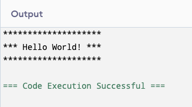

# 👨🏽‍💻 Erstes C# Programm schreiben

1. In VS Code neues Projekt anlegen `dotnet new console -n HelloWorld`.
2. Das Programm lässt sich ausführen mit `dotnet run`
3. Code so anpassen, dass folgender Output entsteht.

    

**Für C#-Kenner (optional)**

4. Frage den Benutzer nach seinem Namen.
5. Speichere die Eingabe des Benutzers in einer String-Variable "name"
6. Output: "Hallo XYZ! Herzlich Willkommen zu Modul 319."

!!! Tipp

    Falls VS Code bei dir noch nicht funktioniert, nutze diesen [Online-Editor](https://www.programiz.com/csharp-programming/online-compiler/)
