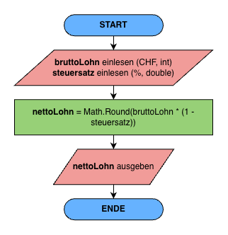
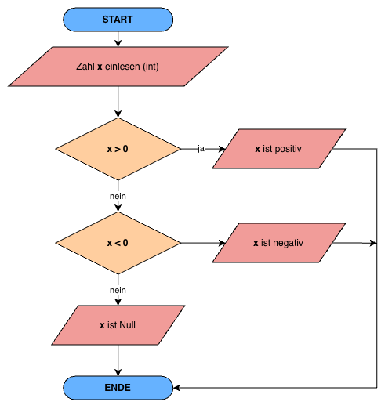

# Lösungen

## Variablen & Datentypen

### Aufgabe 1

```csharp
int x = 5;
double y = 5.67;
string name = "Linda";

Console.WriteLine(x.GetType());
Console.WriteLine(y.GetType());
Console.WriteLine(name.GetType());

// System.Int32
// System.Double
// System.String

```

---

### Aufgabe 2

```csharp
Console.Write("Wie heisst du?: ");
string name = Console.ReadLine();
Console.WriteLine($"Hallo {name}! Schön, dass es dich gibt.");
```

---

### Aufgabe 3

Die Variable `alter` wird in der 2. Zeile als String deklariert. In der dritten Zeile versucht man jedoch mit dieser Variable zu rechnen, was zu einem Konvertierungs-Fehler führt:

`Cannot implicitly convert type 'string' to 'int'`

---

### Aufgabe 4

#### 4.1

```csharp
Console.Write("Wie heisst du?: ");
string name = Console.ReadLine();
Console.WriteLine(name.ToUpper()); // LARS
Console.WriteLine(name.ToLower()); // lars
```

#### 4.2

```csharp
Console.Write("Gib ein Wort ein: ");
string firstWord = Console.ReadLine();
Console.Write("Gib ein zweites Wort ein: ");
string secondWord = Console.ReadLine();
Console.WriteLine($"{firstWord}{secondWord}");
```

---

### Aufgabe 5



---

## Rechnen

### Aufgabe 1

`2 // Bei der Integer-Divsion wird der Nachkommateil abgeschnitten.`

---

### Aufgabe 2

```csharp
// Zwei Zahlen einlesen
Console.WriteLine("Bitte gib zwei beliebige Zahlen ein:");
Console.Write("Zahl 1: ");
decimal zahl1 = decimal.Parse(Console.ReadLine());
Console.Write("Zahl 2: ");
decimal zahl2 = decimal.Parse(Console.ReadLine());

// Mathematische Operationen
decimal resultatAddition = Math.Round(zahl1 + zahl2, 2);
decimal resultatSubtraktion = Math.Round(zahl1 - zahl2, 2);
decimal resultatMultiplikation = Math.Round(zahl1 * zahl2, 2);
decimal resultatDivision = Math.Round(zahl1 / zahl2, 2);

// Ausgabe der Resultate
Console.WriteLine($"{zahl1} + {zahl2} = {resultatAddition}");
Console.WriteLine($"{zahl1} - {zahl2} = {resultatSubtraktion}");
Console.WriteLine($"{zahl1} * {zahl2} = {resultatMultiplikation}");
Console.WriteLine($"{zahl1} / {zahl2} = {resultatDivision}");
```

Werden zwei int-Werte dividiert, findet eine **Ganzzahldivision** statt. Das Ergebnis ist ebenfalls ein int; der Nachkommateil wird abgeschnitten. Ist mindestens ein Operand vom Typ decimal, findet eine **Dezimaldivision** statt und das Ergebnis ist ein decimal.

---

### Aufgabe 3

```csharp
int x = 5;
x++;
Console.WriteLine(x);
x--;
x--;
Console.WriteLine(x);
```

---

### Aufgabe 4

```csharp
decimal preis = 3.20m;
decimal budget = 20.00m;

int anzahl = (int)(budget / preis); // Cast führt dazu, dass Nachkommastelle abgeschnitten wird
decimal rest = budget % preis; // Alternativ ohne Modulo: decimal rest = budget - (anzahl * preis);

Console.WriteLine($"Anzahl Riegel: {anzahl}");
Console.WriteLine($"Restbetrag: {rest:F2} Franken"); // rest:F2 rundet auf zwei Stellen nach dem Komma
```
<!--
---

### Aufgabe 5

```csharp
Console.Write("Erste Zahl: ");
int zahl1 = int.Parse(Console.ReadLine());

Console.Write("Zweite Zahl: ");
int zahl2 = int.Parse(Console.ReadLine());

if (zahl1 > zahl2)
{
    Console.WriteLine("Die erste Zahl ist grösser.");
}
else if (zahl1 == zahl2)
{
    Console.WriteLine("Die beiden Zahlen sind gleich.");
}
else
{
    Console.WriteLine("Die zweite Zahl ist grösser.");
}
```

**Wissensfrage**: Ein Vergleich wie 5 < 10 liefert einen booleschen Wert (bool). In diesem Fall also `true`, da 5 kleiner als 10 ist.

---

### Aufgabe 6

```csharp
Console.Write("Zahl eingeben: ");
int zahl = int.Parse(Console.ReadLine());

if (zahl >= 10 && zahl <= 20)
{
    Console.WriteLine("Die Zahl liegt zwischen 10 und 20.");
}

if (zahl < 0 || zahl > 100)
{
    Console.WriteLine("Die Zahl liegt ausserhalb von 0 bis 100.");
}
```

**Wissensfrage:**
- && (UND) → beide Bedingungen müssen true sein.
- || (ODER) → mindestens eine Bedingung muss true sein.

---

### Aufgabe 7

```csharp
Console.Write("Passwort eingeben: ");
string passwort = Console.ReadLine();

if (passwort.Length > 8)
{
    Console.WriteLine("Das Passwort ist lang genug.");
}
else
{
    Console.WriteLine("Das Passwort ist zu kurz.");
}
```

---

### Aufgabe 8

```csharp
Console.Write("Durchschnittliche Geschwindigkeit (km/h): ");
decimal geschwindigkeit = decimal.Parse(Console.ReadLine());

Console.Write("Verbrauch (Liter pro 100 km): ");
decimal verbrauch = decimal.Parse(Console.ReadLine());

Console.Write("Distanz (km): ");
decimal distanz = decimal.Parse(Console.ReadLine());

decimal fahrzeit = distanz / geschwindigkeit * 60;
decimal benzin = distanz / 100 * verbrauch;

Console.WriteLine($"Fahrzeit: {fahrzeit:F1} Minuten");
Console.WriteLine($"Benzinverbrauch: {benzin:F2} Liter");
```

---

### Aufgabe 9

```csharp
Console.Write("Körpergewicht in kg: ");
decimal gewicht = decimal.Parse(Console.ReadLine());

Console.Write("Körpergrösse in m: ");
decimal groesse = decimal.Parse(Console.ReadLine());

decimal bmi = gewicht / (groesse * groesse);

Console.WriteLine($"Dein BMI beträgt: {bmi:F1}");
```

---

### Aufgabe 10

```csharp
Console.Write("Stunden: ");
int stunden = int.Parse(Console.ReadLine());

Console.Write("Minuten: ");
int minuten = int.Parse(Console.ReadLine());

Console.Write("Sekunden: ");
int sekunden = int.Parse(Console.ReadLine());

decimal dezimalStunden = stunden
                       + minuten / 60m
                       + sekunden / 3600m;

Console.WriteLine($"Zeit in Stunden: {dezimalStunden} h");
```
-->

<!---

---

## Bedingungen I

### Aufgabe 1 - PAP zeichnen



---

### Aufgabe 2 - Code lesen

- a) Zahl1 = 6, Zahl2 = 3
- b) Zahl1 = 7, Zahl2 = 7

---

### Aufgabe 3 - Fehler erkennen

- **Kompilierfehler Zeile 9**: if (wert1 > wert2 && > wert3) — nach && fehlt ein vollständiger boolescher Ausdruck. Korrektur: if (wert1 > wert2 && wert1 > wert3)
- **Zweiter Fehler Zeile 15**: else (wert3 > wert2) — ein else darf keine eigene Bedingung in Klammern haben. Korrektur: einfaches else (reicht hier, da nur noch zwei Fälle übrig sind)

---

### Aufgabe 4 - Ringen 🤼‍♂️

```csharp
Console.Write("Geschlecht [m/w]: ");
string geschlecht = Console.ReadLine();
Console.Write("Gewicht [in Kg]: ");
double gewicht = Convert.ToDouble(Console.ReadLine());

string klasse;
if (geschlecht == "m")
{
    if (gewicht <= 55) klasse = "Fliegengewicht";
    else if (gewicht <= 66) klasse = "Leichtgewicht";
    else if (gewicht <= 84) klasse = "Mittelgewicht";
    else klasse = "Schwergewicht";
}
else
{
    if (gewicht <= 48) klasse = "Fliegengewicht";
    else if (gewicht <= 55) klasse = "Leichtgewicht";
    else if (gewicht <= 63) klasse = "Mittelgewicht";
    else klasse = "Schwergewicht";
}
Console.WriteLine("Gewichtsklasse: " + klasse);
```

---

## Bedingungen II

### Aufgabe 1 - Jahreszeiten 🌼

```csharp
Console.Write("Monat [1-12]: ");
int monat = Convert.ToInt32(Console.ReadLine());

switch (monat)
{
    case 3:
    case 4:
    case 5:
        Console.WriteLine("Frühling"); break;
    case 6:
    case 7:
    case 8:
        Console.WriteLine("Sommer"); break;
    case 9:
    case 10:
    case 11:
        Console.WriteLine("Herbst"); break;
    case 12:
    case 1:
    case 2:
        Console.WriteLine("Winter"); break;
    default:
        Console.WriteLine("Ungültiger Monat"); break;
}
```

---

### Aufgabe 2 - Code lesen

anzahl ist in allen drei Fällen 2.

- a) Note1 = 4.2, Note2 = 3.5: Schnitt = 3.85 → kleiner 4, note1>=4 wahr → **Typ 1**
- b) Note1 = 5.2, Note2 = 5.8: Schnitt = 5.5 → mind. 4, durchschnitt=(int)(11.0)=11, (11+1)/2=6 → nicht 4, nicht 5 → **Typ 4**
- c) Note1 = 3.8, Note2 = 3.3: Schnitt = 3.55 → kleiner 4, beide Noten < 4 → **Typ 0**

---

### Aufgabe 3 - Wochentag ermitteln 📅

```csharp
  Console.Write("Tag: ");
  int t = Convert.ToInt32(Console.ReadLine());
  Console.Write("Monat: ");
  int m = Convert.ToInt32(Console.ReadLine());
  Console.Write("Jahr: ");
  int j = Convert.ToInt32(Console.ReadLine());

  if (m <= 2)
  {
      m += 10;
      j -= 1;
  }
  else
  {
      m -= 2;
  }

  int c = j / 100;
  j = j % 100;

  int h = (((26 * m - 2) / 10) + t + j + j / 4 + c / 4 - 2 * c) % 7;
  if (h < 0)
      h += 7;

  string wochentag;
  switch (h)
  {
      case 0: wochentag = "Sonntag"; break;
      case 1: wochentag = "Montag"; break;
      case 2: wochentag = "Dienstag"; break;
      case 3: wochentag = "Mittwoch"; break;
      case 4: wochentag = "Donnerstag"; break;
      case 5: wochentag = "Freitag"; break;
      case 6: wochentag = "Samstag"; break;
      default: wochentag = "unbekannt"; break;
  }

  Console.WriteLine("Der " + t + "." + m + "." + j + " ist ein " + wochentag);
```

---

### Aufgabe 4 - Ostersonntag 🐣

```csharp
  Console.Write("Jahr: ");
  int jahr = Convert.ToInt32(Console.ReadLine());

  int m = (8 * (jahr / 100) + 13) / 25 - 2;
  int s = jahr / 100 - jahr / 400 - 2;
  m = (15 + s - m) % 30;
  int n = (6 + s) % 7;

  int a = jahr % 19;
  int b = jahr % 4;
  int c = jahr % 7;
  int d = (19 * a + m) % 30;
  if (d == 29)
      d = 28;
  else if (d == 28 && a >= 11)
      d = 27;
  int e = (2 * b + 4 * c + 6 * d + n) % 7;

  int ostertag = 22 + d + e;
  string monat = "März";
  if (ostertag > 31)
  {
      ostertag = ostertag % 31;
      monat = "April";
  }

  Console.WriteLine("Ostersonntag " + jahr + ": " + ostertag + ". " + monat);
  ```

  ---

-->
