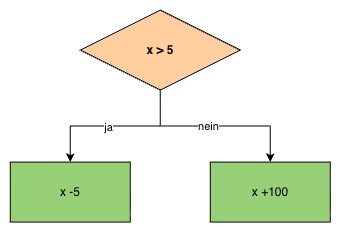

# Bedingungen (1/2)

## Lernziel
Am Ende dieser Lektion wendest du Vergleichs- und logische Operatoren an, setzt if- und if-else-Bedingungen um, stellst Verzweigungen im PAP mit der Raute dar und verschachtelst Bedingungen korrekt.

---

## 1. Einstieg

- Fast jedes Programm **muss Entscheidungen treffen** – ohne Bedingungen könnte ein Programm nie auf unterschiedliche Eingaben unterschiedlich reagieren.
- **Vergleichs- und logische Operatoren** sind die Bausteine, mit denen du solche Entscheidungen formulierst.
- Wer Klammern und Einrückung bei verschachtelten Bedingungen nicht sauber setzt, produziert einen der häufigsten Anfängerfehler in C#.

---

## 2. Grundlagen

### A - Vergleichs- und logische Operatoren

**Vergleichsoperatoren**

| Operator | Bedeutung |
|---|---|
| `==` | gleich |
| `!=` | ungleich |
| `>` | grösser als |
| `<` | kleiner als |
| `>=` | grösser gleich |
| `<=` | kleiner gleich |

```csharp
int alter = 17;
Console.WriteLine(alter >= 18);   // False
```

Das Ergebnis eines Vergleichs ist immer ein `bool` – `true` oder `false`.

**Logische Operatoren**

| Operator | Bedeutung | Beispiel |
|---|---|---|
| `&&` | UND – beide müssen wahr sein | `alter >= 18 && hatAusweis` |
| `||` | ODER – mindestens eine wahr | `istSamstag || istSonntag` |
| `!` | NICHT – kehrt um | `!istFertig` |

```csharp
bool darfFahren = alter >= 18 && hatFuehrerschein;
```

### B - if und if-else

**Einseitige Auswahl (if)**

```csharp
if (x > 10)
{
    Console.WriteLine("x ist grösser als 10.");
}
```

Wird nur ausgeführt, wenn die Bedingung wahr ist – sonst übersprungen.

**Zweiseitige Auswahl (if-else)**

```csharp
if (x > 10)
{
    Console.WriteLine("x ist grösser als 10.");
}
else
{
    Console.WriteLine("x ist 10 oder kleiner.");
}
```

### C - PAP: Die Raute

Neu im PAP: Die **Raute (◇)** stellt eine Bedingung dar, mit zwei Ausgängen: **ja** und **nein**.



### D - Verschachtelte Bedingungen

Innerhalb eines if- oder if-else-Blocks kann eine weitere if- bzw. if-else-Anweisung stehen:

```csharp
if (x > 10)
{
    if (x < 15)
    {
        Console.WriteLine("x liegt zwischen 11 und 14.");
    }
    Console.WriteLine("x ist mindestens 11.");
}
else
{
    Console.WriteLine("x ist 10 oder kleiner.");
}
```

⚠️ Klammern und Einrückung genau beachten – ein `if` ohne `{}` bezieht sich nur auf die direkt folgende Anweisung.

Eine Verschachtelung lässt sich oft mit `&&` zu einer einzigen Bedingung zusammenfassen:

```csharp
// verschachtelt
if (x > 10)
{
    if (x < 15)
    {
        ...
    }
}

// gleichwertig, mit &&
if (x > 10 && x < 15)
{
    ...
}
```

---

## 3. Übungen

### 1. PAP zeichnen
Zeichne einen PAP für: "Prüfe, ob eine eingegebene Zahl positiv, negativ oder null ist."

### 2. Code lesen I
Was gibt das Programm aus, wenn folgende Werte eingegeben würden?

- a) Zahl 1 = 6, Zahl 2 = 3
- b) Zahl 1 = 7, Zahl 2 = 7

```csharp
Console.Write("Zahl 1:");
int zahl1 = Convert.ToInt32(Console.ReadLine());
Console.Write("Zahl 2:");
int zahl2 = Convert.ToInt32(Console.ReadLine());
if (zahl2 < zahl1 && zahl1 > 5)
{
    int temp = zahl1;
    zahl1 = zahl2;
    zahl2 = temp;
}
else
{
    if (zahl1 == zahl2)
        zahl1 = 5;
    zahl2 = 8;
}
Console.WriteLine("Ausgabe 1 = " + Convert.ToString(zahl1));
Console.WriteLine("Ausgabe 2 = " + Convert.ToString(zahl2));
```

### 3. Fehler erkennen
Das folgende Programm sollte drei Werte (Wert 1, Wert 2 und Wert 3) vom Benutzer entgegennehmen und den grössten der drei Werte ausgeben. Leider haben sich **zwei Fehler** eingeschlichen. Bestimme, bei welcher Zeile (Zeilennummer) ein Kompilierfehler auftritt und warum. Korrigiere ihn.

```csharp
01      int anzahl = 1;
02		double wert1 = 0, wert2 = 0, wert3=0, max= 0;
03		Console.Write("Wert " + Convert.ToString(anzahl++)  );
04		wert1 = Convert.ToDouble(Console.ReadLine());
05		Console.Write("Wert " + Convert.ToString(anzahl++));
06		wert2 = Convert.ToDouble(Console.ReadLine());
07		Console.Write("Wert " + Convert.ToString(anzahl++));
08		wert3 = Convert.ToDouble(Console.ReadLine());
09		if (wert1 > wert2 && > wert3)
10			max = wert1;
11		else
12		{
13			if (wert2 > wert3)
14				max = wert2;
15			else (wert3 > wert2)
16				max = wert3;
17		}
18		Console.WriteLine("Der grösste Wert ist:"+ Convert.ToString(max));
```

### 4. Ringen
Beim Ringen wird in verschiedenen Gewichtsklassen gerungen:

| Gewichtsklasse | Männer | Frauen |
|---|---|---|
| Fliegengewicht | bis 55kg | bis 48kg |
| Leichtgewicht | bis 66kg | bis 55kg |
| Mittelgewicht | bis 84kg | bis 63kg |
| Schwergewicht | ab 85kg | ab 64kg |

Schreibe ein Programm, das den Benutzer zur Eingabe der beiden Informationen **Geschlecht** und **Gewicht** auffordert. Ermittle mit Hilfe von Verzweigungen die passende Gewichtsklasse und gib sie aus.

Beispiel: Geschlecht = m, Gewicht = 75 → Ausgabe: Gewichtsklasse: Mittelgewicht

---

## 4. Weiterführende Beispiele und Gedanken

- Achtung, typische Stolperfalle: Ein `else` ohne eigene Bedingung fängt einfach "alles andere" auf – ein `else (bedingung)` ist ungültige Syntax.
- Nächste Lektion: switch-case als Alternative zu langen `else if`-Ketten, sowie komplexere Algorithmen mit mehreren Bedingungen.
- Überlege: Bei welchen Entscheidungen in deinem Alltag reicht eine einzige Bedingung, und wo brauchst du mehrere verschachtelte oder verknüpfte Bedingungen (z.B. Versandkosten, Notenskala)?
