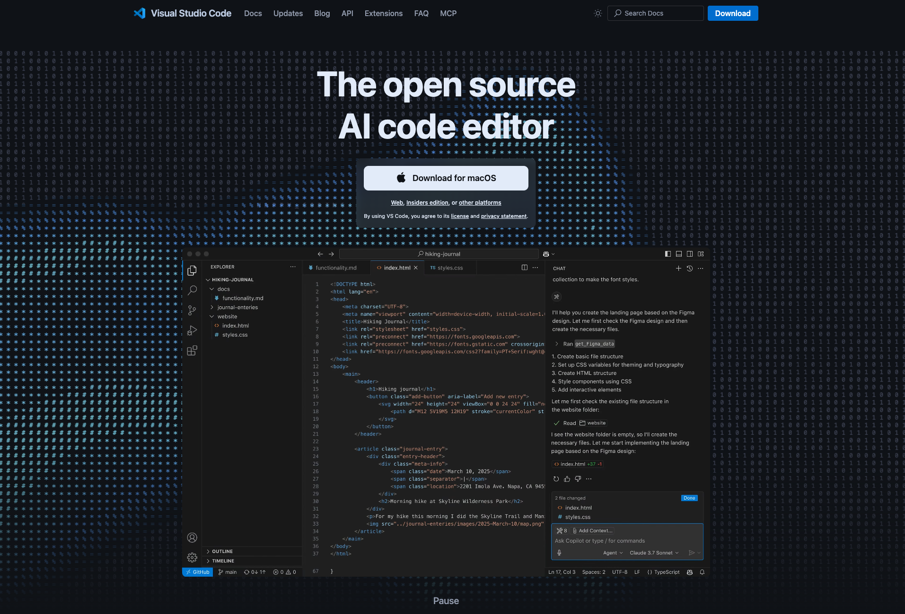
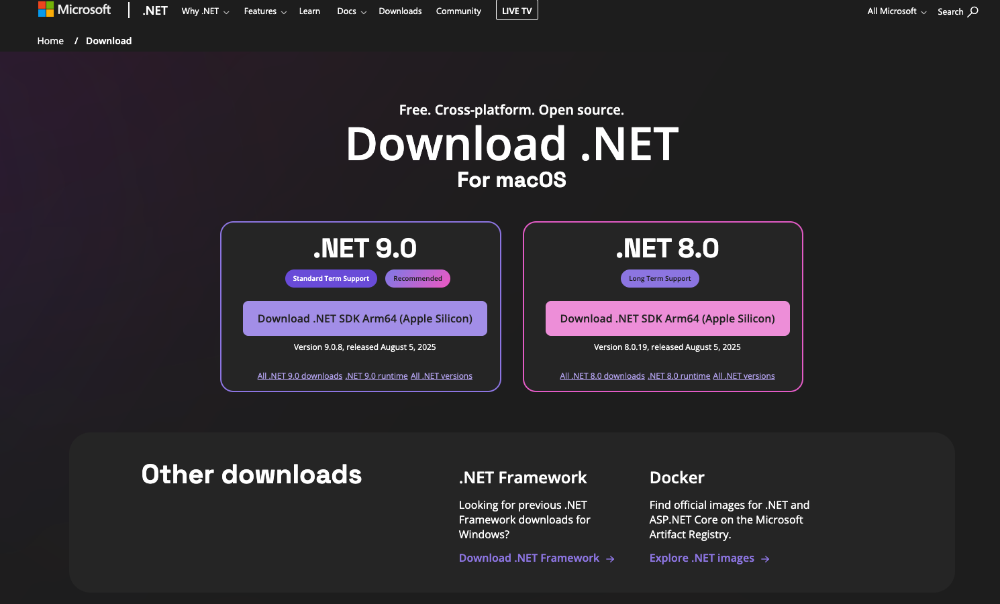
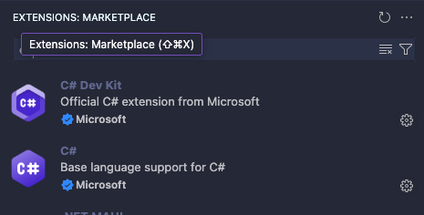

# Einführung & Organisation

## Lernziel
Am Ende dieser Lektion weisst du: wie dieses Modul aufgebaut ist, wie du deine Entwicklungsumgebung (VS Code + .NET-SDK) einrichtest, wie du einen GitHub-Account und dein erstes Repository anlegst – und du hast dein erstes eigenes C#-Programm ausgeführt.

## 1. Einstieg
*Warum ist das wichtig?*

- Fast jede Software, die du täglich nutzt – Apps, Games, Kassensysteme – **wurde von Menschen programmiert**.
- Auch im Zeitalter der KI bleibt Programmieren-Können zentral: **Nur wer den Code versteht**, kann beurteilen, ob ein KI-Vorschlag stimmt, und kann Fehler darin erkennen und korrigieren.
- Die Lehrabschlussprüfung verlangt Code-Verständnis **ohne KI-Hilfe** – Grundlagen sind damit unabhängig von KI-Tools Pflicht.
- Am Ende dieses Semesters schreibst du eigene Programme mit eigener Logik – und kannst damit auch KI-generierten Code kompetent einschätzen.

## 2. Grundlagen
*Um was geht es? Was musst du wissen?*

- Das Modul besteht aus **vier Bausteinen**:
    1. theoretische Grundlagen
    2. praktisches Programmieren
    3. Arbeiten mit Git und GitHub
    4. drei Prüfungen über das Semester verteilt.
- Ein Programm ist wie ein **Rezept**: eine Anleitung, die der Computer Schritt für Schritt abarbeitet. VS Code ist der Editor, in dem du diese Anleitung schreibst; C# ist die Sprache, in der du sie formulierst.
- **GitHub** ist die Plattform, auf der du deinen Code sicherst, später mit anderen zusammenarbeitest und dir ein kleines Portfolio aufbaust.

```c#
Console.WriteLine("Hello World")
```
Das ist bereits ein vollständiges C#-Programm: Es gibt den Text "Hello World" aus.

## 3. Anwendung
# 🧑🏼‍💻 Setup: VS Code & .NET SDK

## Schritt 1 – VS Code installieren
1. Öffne [https://code.visualstudio.com/](https://code.visualstudio.com/)
2. Lade die Version für dein Betriebssystem herunter
3. Installiere mit Standard-Einstellungen
4. Sprache **Deutsch** aktivieren (optional über "German Language Pack")



## Schritt 2 - .NET SDK installieren
Damit C#-Programme ausgeführt werden können, benötigst du das **.NET SDK**.

1. Öffne [https://dotnet.microsoft.com/en-us/download](https://dotnet.microsoft.com/en-us/download)
2. Wähle die aktuelle **Long Term Support (LTS)** Version (z. B. .NET 8 LTS).
3. Lade das passende Paket für dein Betriebssystem herunter.
4. Installiere mit den Standard-Einstellungen.
5. Prüfen, ob alles funktioniert:`dotnet --version`



## Schritt 3 – VS Code Erweiterungen installieren
1. Öffne Visual Studio Code.
2. Drücke `Strg + Shift + X` (Windows/Linux) oder `Cmd + Shift + X` (macOS), um den Erweiterungs-Manager zu öffnen. Alternativ kannst du auch über das Menü mit `Code > Preferences > Erweiterungen`gehen.
3. Suche nach "C#"
4. Installiere die Erweiterung "C# Dev Kit" von Microsoft.



## 6. Weiterführende Beispiele und Gedanken
*Transfer*

- Überlege: Wo in deinem eigenen Alltag oder Lehrbetrieb könnte ein kleines selbst geschriebenes Programm bereits jetzt nützlich sein?
- Nächste Lektion: Was passiert eigentlich, wenn du auf "Run" drückst – Compiler versus Interpreter.
- Zusätzlicher Gedanke: Viele grosse Open-Source-Projekte, die du vielleicht schon nutzt (z.B. Spiele-Engines, Programmiersprachen selbst), werden öffentlich auf GitHub entwickelt – dein erstes Repository heute ist technisch derselbe Mechanismus im Kleinen.
- Auch wenn du später im Berufsleben KI-Tools zum Programmieren nutzt: Je besser du die Grundlagen beherrschst, desto gezielter kannst du diese Tools einsetzen und desto sicherer erkennst du, wenn ein KI-Vorschlag fehlerhaft ist.
