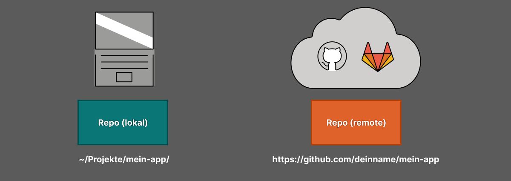

# 🦊 Git & Github

## 📦 Was ist ein Repository?

Ein *Repository* (kurz: "Repo") ist dein **Projekt mit Versionsgeschichte**.

Es enthält:

- Den aktuellen **Code**
- Alle bisherigen **Versionsstände** (Commits)
- **Weitere Infos** (z.B. Branches, Merges etc.)

> 📘 Ein Repository ist wie ein Tagebuch deines Codes.

---

## 🔄 Zwei Typen von Repositories

| Typ              | Beschreibung                       | Beispiel                                |
|------------------|------------------------------------|-----------------------------------------|
| **Lokales Repo** | Auf deinem Computer mit | `~/Projekte/mein-app/`                  |
| **Remote Repo**  | Auf GitHub, GitLab usw.            | `https://github.com/deinname/mein-app` |

> 💡 Nutze `git init`, um ein lokales Repo zu starten – oder `git clone`, um ein Remote-Repo zu holen.

---

## 🤔 Was ist ein Commit?

Ein *Commit* ist ein **Speicherpunkt** im Projekt.

Er enthält:

  - **Was** wurde geändert?
  - **Wer** hat es geändert?
  - **Wann**?
  - **Warum**? (→ **Commit Message**)

---

## 💧 Der Git-Commit-Workflow

1. 📝 **Make** changes
2. 📦 **Stage** changes `git add .`
3. 💾 **Commit** changes `git commit -m <message>`
4. 🤜🏼 **Push** changes `git push`

---

## 🛠️ Git – Wichtige Befehle

| Befehl | Bedeutung | Beispiel |
|--------|-----------|----------|
| `git init` | Neues lokales Git-Repo erstellen | `git init` |
| `git clone <url>` | Repo von GitHub klonen | `git clone https://github.com/user/repo.git` |
| `git status` | Aktuellen Status anzeigen | `git status` |
| `git add <datei>` | Datei zur Staging-Area hinzufügen | `git add main.py` |
| `git add .` | Alle Änderungen hinzufügen | `git add .` |
| `git commit -m "Nachricht"` | Änderungen speichern (lokal) | `git commit -m "Funktion hinzugefügt"` |
| `git push` | Änderungen zu GitHub hochladen | `git push` |
| `git pull` | Änderungen von GitHub herunterladen | `git pull` |
| `git log` | Commit-Historie anzeigen | `git log` |
