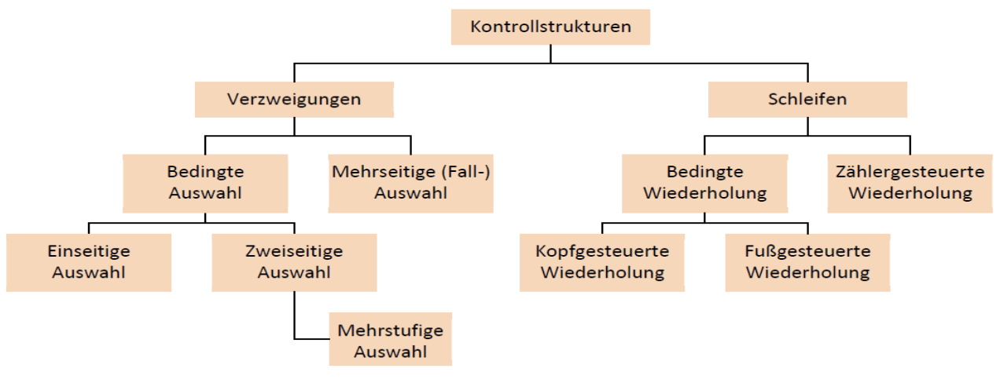

# Kontrollstrukturen 🔀🔁

## Übersicht

Kontrollstrukturen bestehen aus zwei Kategorien: Verzweigungen (z.B. if-then-else) und Schleifen (z.B. while). Bei Verzweigungen geht es prinzipiell darum, ob eine Anweisung oder ein Block von Anweisungen ausgeführt werden soll oder nicht. Bei Schleifen geht es darum, dass eine Anweisung oder ein Block von Anweisungen unter Umständen mehrmals ausgeführt werden soll.



---

## Verzweigungen 🔀

### if | Einseitige Auswahl

Bei vielen Problemstellungen ist die Verarbeitung von Anweisungen von Bedingungen abhängig. Nur wenn die Bedingung erfüllt ist, wird die betreffende Anweisung (bzw. der Anweisungsblock) ausgeführt. Anderenfalls wird die Anweisung übersprungen.

```c#
if (x > 10)
{
    Console.WriteLine("Das wird ausgeführt, wenn die Aussage x > 10 wahr ist.")
}
```

---

### if-else | Zweiseitige Auswahl

Im Gegensatz zur einseitigen Auswahl hat die zweiseitige Auswahl noch am Schluss einen else-Teil. Während die einseitigen Auswahl nur entschieden kann, ob eine Anweisung oder ein Block von Anweisungen ausgeführt werden soll oder nicht, kann die zweiseitige Auswahl entscheiden, welcher der beiden Teile (if oder else) ausgeführt werden soll.

```c#
if (x > 10)
{
    Console.WriteLine("Das wird ausgeführt, wenn die Aussage x > 10 wahr ist.")
} else {
    Console.WriteLine("Das wird ausgeführt, wenn die Aussage x > 10 unwahr ist. ")
}
```

---

### Verschachtelung

Eine mehrstufige Auswahl erreichen Sie in C#, indem Sie mehrere if- bzw. if-else-Anweisungen schachteln. Dazu schreiben Sie innerhalb eines Anweisungsblocks einer if- bzw. if-else-Anweisung eine weitere if- bzw. if-else-Anweisung.

```c#
if (x > 10)
{
    if (x < 15)
    {
        Console.WriteLine("In diesem Fall muss x gleich 11, 12, 13 oder 14 sein.")
    }
    Console.WritLine("In diesem Fall ist x mindestens 16 oder grösser.")
} else {
    Console.WriteLine("In diesem Fall ist x gleich 10 oder kleiner.")
}
```

---

### switch | Mehrstufige Auswahl

Bei if-Konstruktionen lassen sich immer nur zwei alternative Programmteile ausführen, da eine Bedingung als logischer Ausdruck nur die Werte true bzw. false ergeben kann. Bei einer mehrseitigen Auswahl testen Sie den Wert einer Variablen oder eines komplexen Ausdrucks. Diese Variable bzw. dieser Ausdruck wird als Selektor bezeichnet. In Abhängigkeit vom Wert des Selektors können fallweise (case) verschiedene Anweisungsblöcke ausgeführt werden. Die mehrseitige Auswahl wird daher auch Selektion genannt.

```c#
switch (month)
{
    case "Januar":
    case "Februar":
    case "März":
        Console.WriteLine("1. Quartal");
        break;
    case "April":
    ...
    default:
        Console.WriteLine("ungültiger Monatsname");
        break;
}
```

---

## Schleifen (Wiederholungen) 🔁

Eine Schleife besteht aus der **Schleifensteuerung** und dem **Schleifenrumpf**. Der Schleifenrumpf umfasst den Programmteil, der wiederholt werden soll. Die Schleifensteuerung legt fest, wie oft die Anweisungen im Schleifenrumpf wiederholt werden sollen bzw. nach welchen Kriterien entschieden wird, ob eine Wiederholung erfolgen soll.

### while | Kopfgesteuerte Schleife

Bei der while-Anweisung handelt es sich um eine kopfgesteuerte Schleifenstruktur. Die Ausführung der Anweisungen im Schleifenrumpf ist von der Gültigkeit einer Bedingung abhängig, die gleich zu Beginn der Anweisung überprüft wird. Solange (while) die Bedingung erfüllt ist, werden die folgenden Anweisungen (Schleifenrumpf) ausgeführt. Anschliessend folgt der nächste Durchlauf der Schleife und die Bedingung wird erneut geprüft. Ist die Bedingung nicht erfüllt, wird das Programm hinter der while-Anweisung fortgesetzt.

```c#
int counter = 1;

while (counter < 10)
{
    Console.WriteLine(counter);
    counter += 2;                   // Erhöht die Variable counter jeweils um +2
}

// Das Programm gibt die Zahlen 1, 3, 5, 7 und 9 aus.
```

---

### do-while | Fussgesteuerte Schleife

Die do-while-Anweisung ist eine fussgesteuerte Schleifenstruktur. Die Bedingung wird erst nach dem Durchlauf des Schleifenrumpfes ausgewertet. Dadurch wird der Schleifenkörper mindestens einmal ausgeführt. Wie bei der kopfgesteuerten while-Anweisung wird der Schleifenrumpf ausgeführt, solange die Bedingung erfüllt ist.

```c#
double presentValue = 1000.0;       // Der aktuelle Werte
double futureValue = 10000.0;       // Wert, den wir erreichen wollen
const double interestRate = 4.5     // Zinssatz von 4,5%
int year = 0;

do
{
    presentValue *= 1.0 + interestRate / 100;   // Startwert um Zinsen erhöhen
    year++;                                     // Jahr um 1 erhöhen
}
while (presentValue < futureValue);     // Die Schleife wird solange ausgeführt, bis der aktuelle Wert den angestrebten Zukunftswert übersteigt

Console.WriteLine($"Um den Zukunftswert zu erreichen, brauchst du {year} Jahre");
```

---

## for | Zählergesteuerte Wiederholung

Wenn bereits zu Begin der Schleife genau bekannt ist, wie oft der Schleifenrumpf (eine Anweisung oder ein Anweisungsblock) wiederholt werden soll, ist die Verwendung der for-Schleife die kompakteste Form.

```c#
for (int i = 1; i < 5; i++)
{
    Console.WriteLine("Hallo!");
}

// Hier wird 4x Hallo! ausgegeben
```
